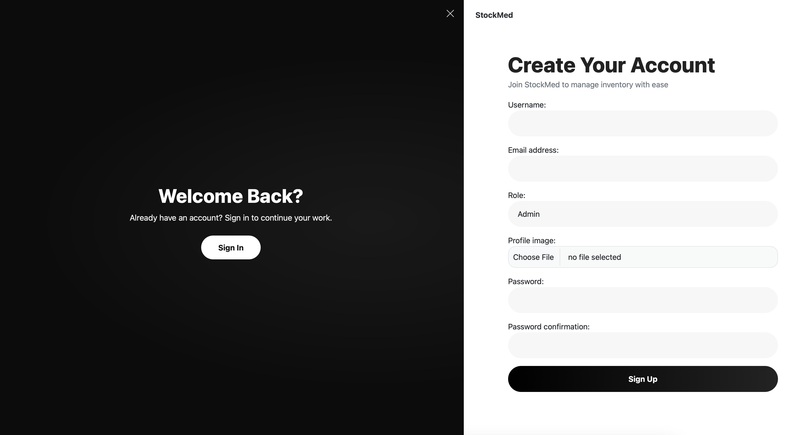
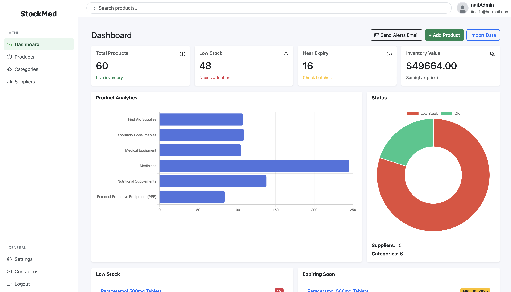
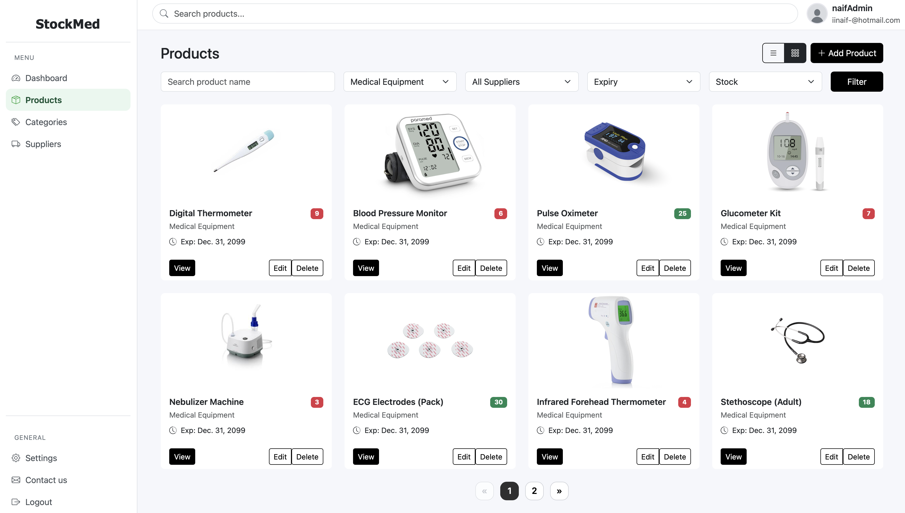

# 💊 StockMed – Pharmaceutical & Medical Inventory Management System

A **Django-based** web application for managing **medical and pharmaceutical inventory**, designed for **admins** and **employees** with role-based permissions.  
Includes **product, category, and supplier management**, stock tracking, expiry alerts, analytics, and CSV import/export.

---

## 📌 Features

### **🔹 Product Management**
- Add new products (Admin & Employee)
- Edit product details (Admin & Employee)
- Delete products (Admin only)
- View product list in **Card** or **List** view
- Product search & filtering
- View product details with image support
- Stock management (update stock levels, view stock status)

### **🔹 Category Management**
- Add, edit, delete categories (Admin only)
- View all categories list

### **🔹 Supplier Management**
- Add, edit, delete suppliers (Admin only)
- View supplier list and details

### **🔹 Reports & Analytics**
- Inventory value tracking
- Low stock overview
- Near expiry overview
- Products per category chart
- Stock status chart

### **🔹 Notifications**
- **Email alerts** for:
  - Low stock products
  - Products nearing expiry (≤ 30 days)
- Test email alerts from Admin Dashboard

### **🔹 Import & Export**
- Import products from CSV (Admin only)
- Export inventory data to CSV

---

## 🛠 Tech Stack
- **Backend:** Django 4.x, Python 3.x
- **Frontend:** Bootstrap 5, HTML5, CSS3, JavaScript
- **Database:** SQLite (default, can switch to PostgreSQL/MySQL)
- **Email:** SMTP (e.g., Gmail App Password)

---

## 📷 Screenshots

### Register Page

### Dashboard

### Products

